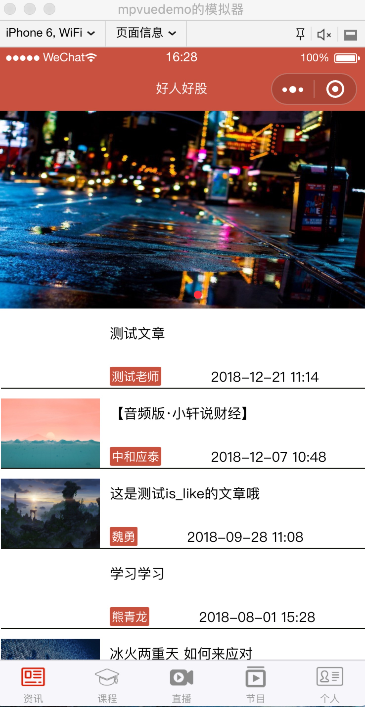
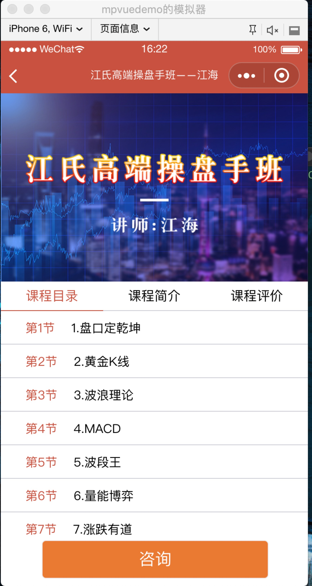
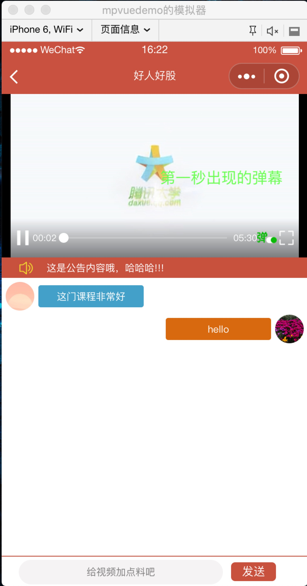
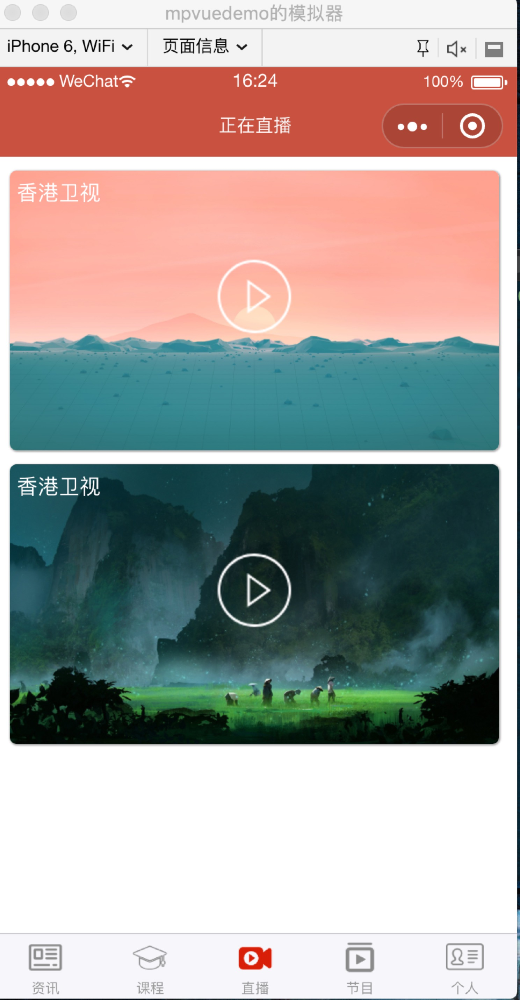
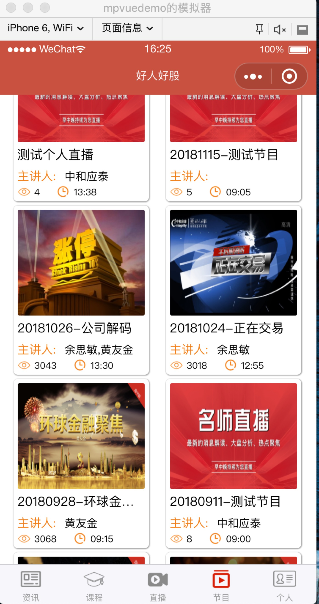
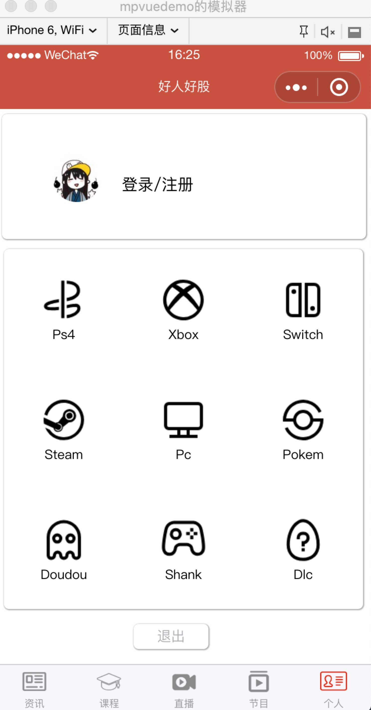

# 项目说明

> 基于mpvue的好人好股商学院小程序

# 模块说明

> 资讯模块, 课程模块,直播模块,节目模块,用户模块

# 项目截图

## 资讯


## 课程



## 播放页


## 直播页


## 节目页


## 用户页

<!-- 


 -->


# 构建

``` bash
# install dependencies
npm install

# serve with hot reload at localhost:8080
npm run dev

# build for production with minification
npm run build

# build for production and view the bundle analyzer report
npm run build --report
```